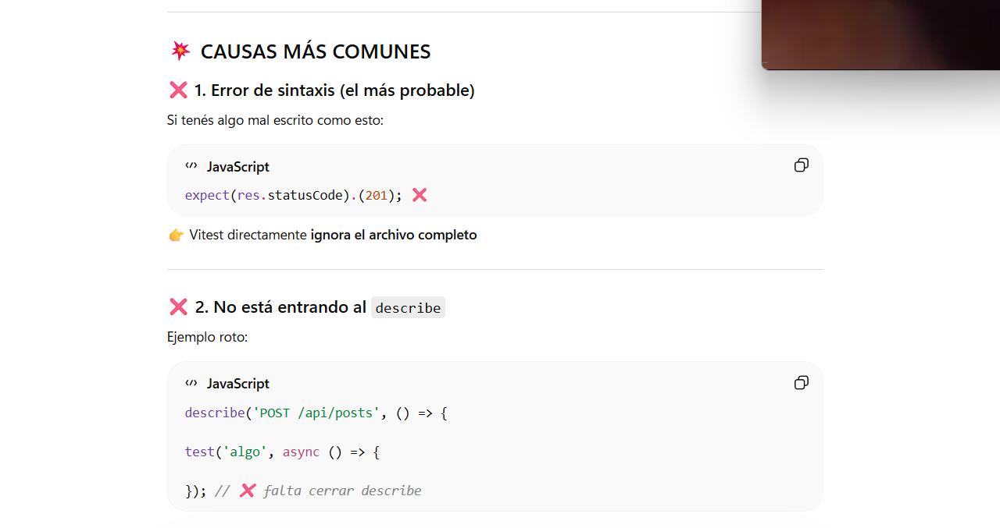
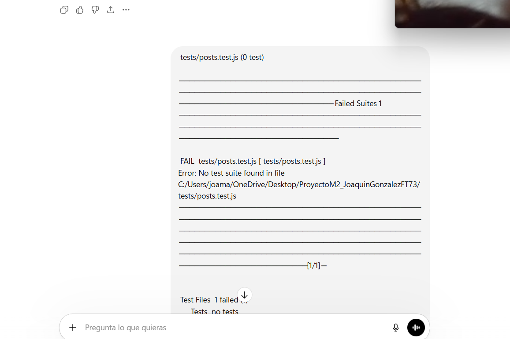
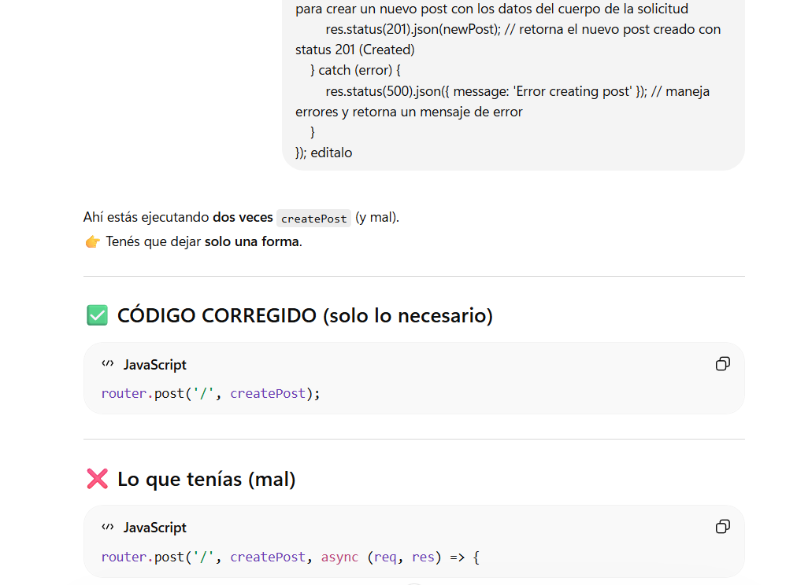
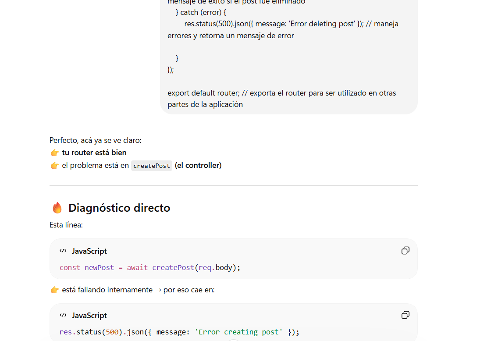
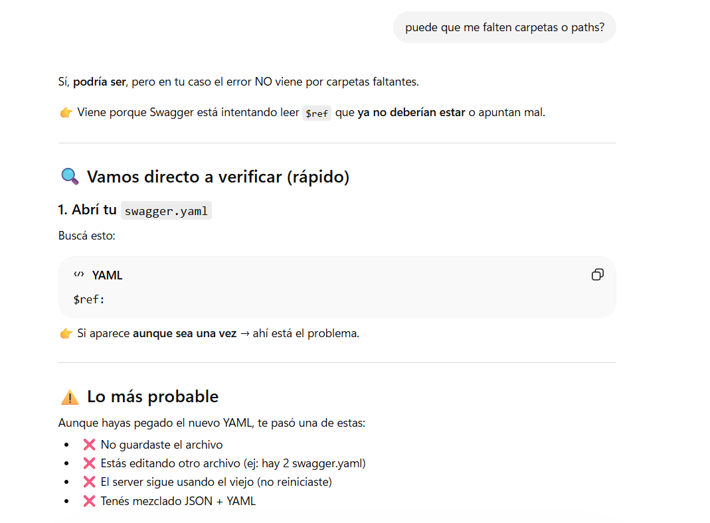
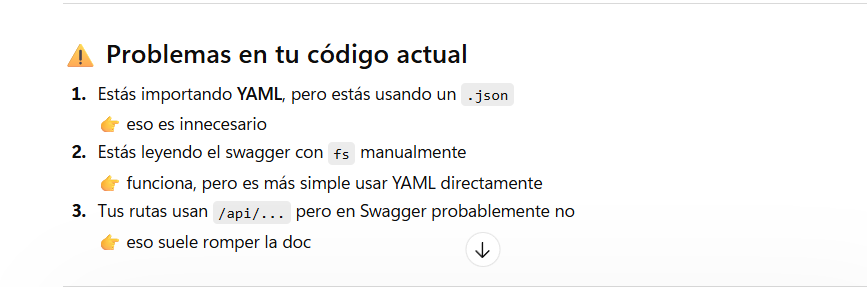
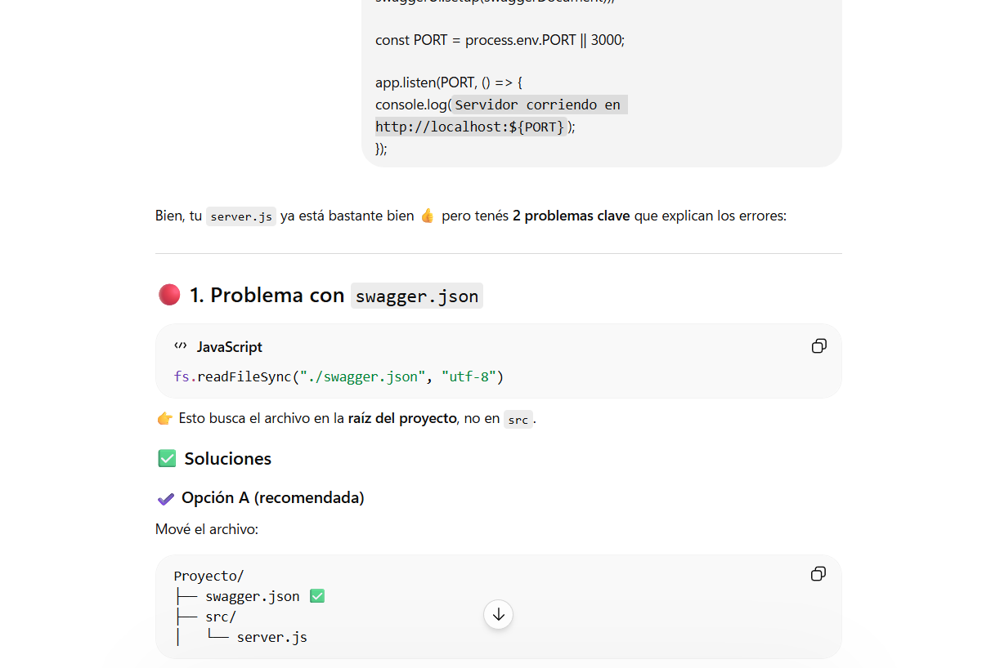
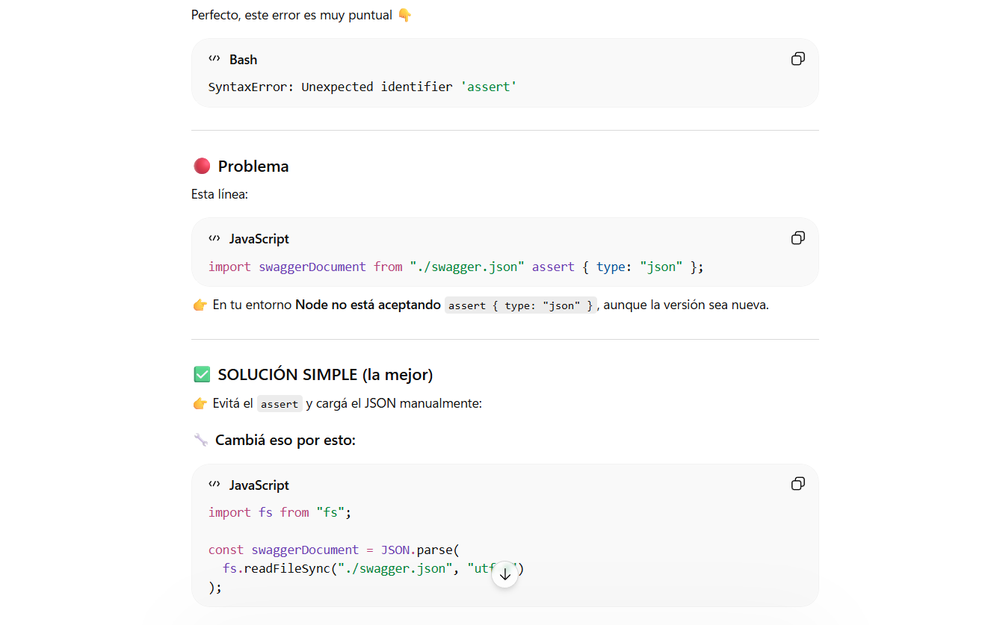
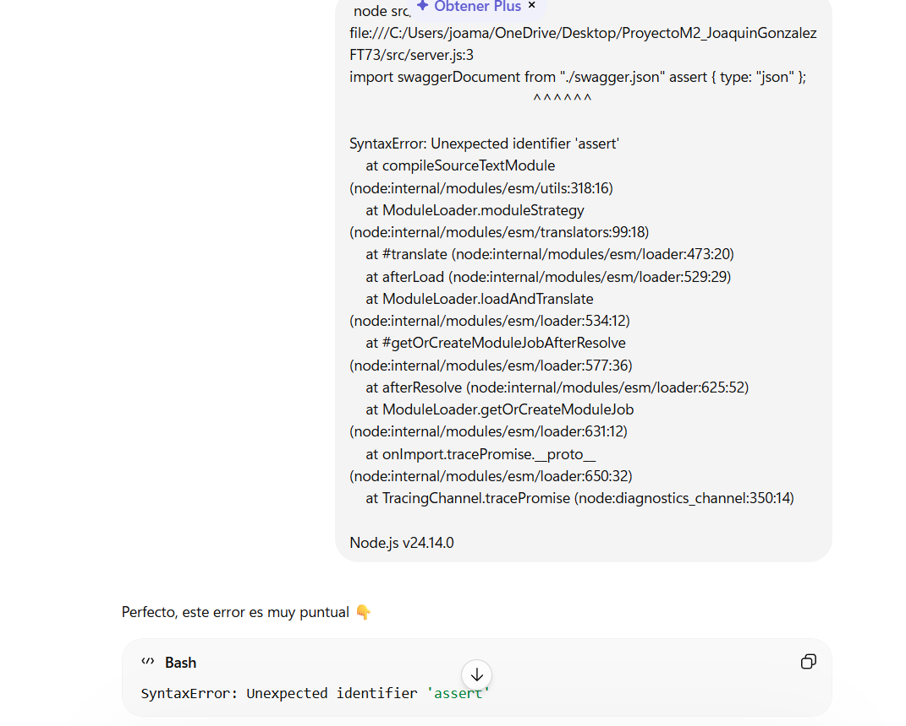
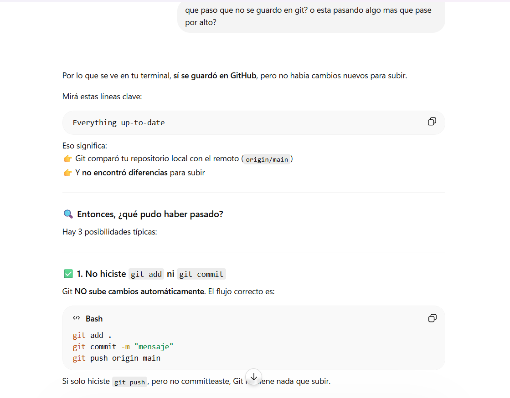

# Uso de Inteligencia Artificial en el Proyecto

##  Introducción

Durante el desarrollo de esta API REST, se utilizó inteligencia artificial (IA) como herramienta de apoyo para:

- Detectar errores en tiempo real
- Proponer soluciones técnicas
- Corregir estructura de código
- Mejorar la documentación (Swagger y README)
- Guiar el proceso de debugging

El uso de IA no reemplazó el aprendizaje, sino que permitió entender mejor los errores y cómo solucionarlos.

---

##  Errores Encontrados y Soluciones

A lo largo del desarrollo surgieron varios problemas comunes en proyectos backend. A continuación se documentan los más relevantes y cómo fueron resueltos.

### 1️⃣ Error en Vitest: `describe is not defined`

**Problema:**  
Al ejecutar los tests, Vitest no reconocía funciones como `describe` o `test`.

**Causa:**  
Falta de importación de las funciones desde la librería.

**Capturas de Pantalla:**





**Solución:**

```javascript
import { describe, test, expect } from "vitest";

describe("POST /api/posts", () => {
  test("should create a new post", async () => {
    expect(res.statusCode).toBe(201);
  });
});
```

**Explicación:**  
Captura de pantalla que muestra la importación correcta de las funciones de Vitest (`describe`, `test`, `expect`) en la parte superior de un archivo de pruebas en JavaScript, con resaltado de sintaxis donde las palabras clave aparecen en color púrpura y las cadenas en verde. El código demuestra las importaciones de módulos necesarias para resolver el error "describe is not defined".

**Resultado:**  
Esto permitió que los tests funcionaran correctamente.

---

### 2️⃣ Error en creación de posts (doble ejecución)

**Problema:**  
El endpoint `createPost` se ejecutaba dos veces o generaba comportamientos inesperados.

**Causa:**  
Confusión en la estructura entre controlador y servicio (lógica duplicada o mal separada).

**Capturas de Pantalla:**





**Código incorrecto (lógica mezclada en el controlador):**

```javascript
// En Post.Controllers.js
export const createPost = async (req, res, next) => {
  try {
    const { title, content, authorId } = req.body;
    if (!title || !content || !authorId) {
      return res.status(400).json({ error: "Missing fields" });
    }
    // Lógica de DB en el controlador (incorrecto)
    const { rows } = await pool.query(
      "INSERT INTO posts (title, content, author_id) VALUES ($1,$2,$3) RETURNING *",
      [title, content, authorId],
    );
    res.status(201).json(rows[0]);
  } catch (err) {
    next(err);
  }
};
```

**Código correcto (separación de responsabilidades):**

```javascript
// En Post.Controllers.js
export const createPost = async (req, res, next) => {
  try {
    const { title, content, authorId } = req.body;
    if (!title || !content || !authorId) {
      return res.status(400).json({ error: "Missing fields" });
    }
    // Llama al servicio para la lógica de DB
    const data = await service.createPost({
      title,
      content,
      author_id: authorId,
    });
    res.status(201).json(data);
  } catch (err) {
    next(err);
  }
};

// En Posts.Services.js
export const createPost = async ({ title, content, author_id }) => {
  const { rows } = await pool.query(
    "INSERT INTO posts (title, content, author_id) VALUES ($1,$2,$3) RETURNING *",
    [title, content, author_id],
  );
  return rows[0];
};
```

**Solución:**  
Se separó correctamente la lógica:

- **Controlador:** Maneja la solicitud y respuesta (request/response).
- **Servicio:** Maneja la lógica de base de datos.

---

### 3️⃣ Mezcla de JSON y YAML en Swagger

**Problema:**  
Errores al cargar la documentación.

**Causa:**  
Se estaban usando estructuras de JSON dentro de un archivo YAML.

**Capturas de Pantalla:**





**Ejemplo incorrecto (mezcla de JSON en YAML):**

```yaml
example: { "title": "Post", "content": "Texto" }
```

**Ejemplo correcto (YAML puro):**

```yaml
example:
  title: Post
  content: Texto
```

---

### 4️⃣  Error en Swagger: uso incorrecto de `type`

**Problema:**  
Swagger no mostraba correctamente los modelos.

**Causa:**  
Definición incorrecta de tipos (por ejemplo, usar JSON en lugar de `schema`).

**Capturas de Pantalla:**







**Solución:**

Uso correcto de `components.schemas`:

```yaml
schema:
  type: object
  properties:
    title:
      type: string
```

---

### 5️⃣  Problema de organización en Swagger (todo en "default")

**Problema:**  
Todos los endpoints aparecían agrupados en "default".

**Causa:**  
Falta de uso de etiquetas (`tags`).

**Solución:**

Definir las etiquetas en la raíz del documento:

```yaml
tags:
  - name: Authors
  - name: Posts
```

Y luego en cada endpoint:

```yaml
tags: [Posts]
```

---

### 6️⃣  Error de conexión a PostgreSQL

**Problema:**  
Errores como:

- `password authentication failed`
- `client password must be a string`

**Causa:**

- Variables de entorno mal configuradas
- Usuario incorrecto en la base de datos
- Mezcla entre `DATABASE_URL` y variables locales

**Solución:**

- Validar el archivo `.env`
- Usar correctamente `process.env`
- Asegurar coincidencia entre usuario y contraseña en PostgreSQL

---

### 7️⃣  Error de permisos en base de datos

**Problema:**  
`permiso denegado a la tabla authors`

**Solución:**

```sql
GRANT ALL PRIVILEGES ON ALL TABLES IN SCHEMA public TO joaquin;
```

---

### 8️⃣  Problema con Git (cambios no subidos)

**Problema:**  
Cambios realizados localmente no aparecían en GitHub.

**Causa:**  
Falta de `git push`.

**Captura de Pantalla:**



**Solución:**

```bash
git add .
git commit -m "Actualizar documentación y corregir errores"
git push
```

---

##  Conclusión

El uso de la inteligencia artificial permitió:

- Reducir tiempos de debugging
- Entender errores comunes en backend
- Mejorar la calidad del código
- Aprender buenas prácticas reales

Este documento refleja el valor educativo de usar IA como herramienta complementaria en el desarrollo de software.
